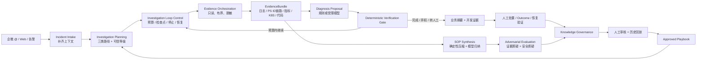

# IT 智能排障系统 · 架构 v4（MateClaw-only）

> 状态：**现行设计，架构师评审通过（P1 实施门）**
>
> 产品事实来源：`docs/intelligent-troubleshooting/recording-product-baseline.md`
>
> 评审记录：`docs/intelligent-troubleshooting/architecture-review-v4.md`
>
> 2026-07-28 v0.8 增量：把 Loop Engineering 建模为有界调查内循环与知识改进外循环；
> 多 Agent 只用于结构化反证和影子评测，不进入默认在线主链，也不取得裁决权。
>
> 替代：`intelligent-troubleshooting-architecture-v3.md`。v3 的单 MateClaw 运行时、确定性命中路、
> 只读取证、人工审核和禁止生产写仍有效；v4 修正其把“日志→SOP”降为辅助能力、只按错误码组织主轴、
> 以及把 Web 当作主要入口的产品偏差。

## 0. 结论先行

系统的中心不是错误码查表，也不是让 Agent 自由排障，而是一条**证据脊柱**：

```text
报障上下文 → 只读证据计划 → 观测证据 → 可引用诊断
                                      ├→ 给服务经理 / 开发的双投影
                                      └→ 可审核的 PlaybookDraft / KnowledgeCandidate
```

同一条证据脊柱同时服务两个闭环：

1. **在线排障闭环**：尽快给出可核验的定位、影响面和下一步；
2. **知识生产闭环**：把证据与人工解法沉淀为经审核、可回放的 Playbook。

这两个业务闭环进一步按 Loop Engineering 落成两层受控循环：

- **调查内循环**：计划 → 取证 → 提议 → 校验 → 继续 / 完成 / 弃权 / 转人工；
- **知识改进外循环**：草稿 → 结构化反证 → 回放 → 人工裁决 → 版本化知识 → outcome 反馈。

循环由服务端预算、检查点和确定性 Gate 驱动，不由模型自行宣布“完成”。多 Agent 的一致意见也不是证据，
不能代替引用校验、历史回放或人工审核。

错误码型、场景型和开放探索型是三种不同调查路径，必须显式标注可信等级。模型可以提出场景、归纳草稿和
解释证据，但不能把自己的选择伪装成确定性命中，不能批准知识，也不能执行生产写。

## 1. 第一性原理

### 1.1 用户真正购买的结果

用户不是要一个“智能排障平台”，而是要减少以下时间：

- 服务经理反复追问客户 ID、截图、时间点；
- 开发在日志、链路、K8S、代码之间来回切换；
- 每次从零还原调用链和排查步骤；
- 同类故障解决后没有成为下次可复用的方法。

因此系统的北极星结果是：

> **从一条不完整报障，到一个带证据、可交接、可复用的定位结论所需的时间。**

### 1.2 不可妥协约束

| 编号 | 约束 | 直接工程含义 |
|---|---|---|
| A1 | 证据先于推理 | 结论只能引用本次服务端实际取得且非 `MISSING` 的 EvidenceResult |
| A2 | 一份事实，两种投影 | 业务摘要和开发证据来自同一个 Diagnosis |
| A3 | 草稿不是权威 | AI 生成 `PlaybookDraft`；只有审核和回放通过的 Playbook 才能稳定路由 |
| A4 | 可信等级不混淆 | 明确字段、规则或模型提议的路由必须可见，前端不能统一显示成“已命中” |
| A5 | 自动化止于只读 | 生产写工具不注册；人工批准只推进状态，不触发执行 |
| A6 | 不完整比编造更好 | 缺证据、引用失效、低置信时必须 abstain 或转人工 |
| A7 | 原始日志不进模型 | 先限量、脱敏和确定性压缩，再给模型结构化骨架 |
| A8 | MateClaw 是唯一运行底座 | 同一 Java 服务、身份、工作区、通道、模型配置和审计 |
| A9 | 一种能力只有一个实现 | 在线诊断和 SOP 合成都复用同一 Evidence Orchestration |
| A10 | 真实验证决定放权 | recorded replay 只证明工程链路，不能冒充真实观测云已验证 |
| A11 | 循环状态显式且有界 | 每次迭代、预算消耗、检查点和停止原因可审计；到限必须 abstain / 转人工 |
| A12 | 反证不是裁决 | 多 Agent 只提交结构化质疑；共识、票数和修辞不能成为权威依据 |

### 1.3 当前明确不做

- 不自动重启、扩容、切流、改配置、改数据或改代码；
- 不让模型猜出错误码后进入错误码确定性命中路；
- 不把 Wiki、Memory、Skill 或聊天记录当作诊断权威；
- 不再引入第二套排障平台、独立 Python orchestrator 或额外 Agent runtime；
- 不让多个 Agent 自由辩论后以多数票决定根因、可信等级或知识晋升；
- 不允许 Agent 递归创建 Agent、扩大工具范围或自行延长预算；
- 不把复杂大屏和炫技交互当作 MVP 成功证据。

## 2. 一个证据脊柱，两个闭环



两个闭环共享 Incident、EvidenceBundle 和 Provenance，但状态机相互独立：

- 故障可以尚未关闭就产生证据型 `PlaybookDraft`；
- 没有人工解法或真实 outcome 的草稿不能直接晋升为权威 Playbook；
- 关闭故障不等于自动批准知识；知识审核失败不回滚已完成的故障处置。

`ERROR_CODE_PLAYBOOK` 仍是固定的一轮确定性执行，Loop Control 不引入模型；`SCENARIO_PLAYBOOK` 与
`OPEN_DISCOVERY` 才可能在预算内继续取证。对抗评测首阶段只在 P2 历史样本和知识候选上影子运行，不阻塞
在线结果，也不改变现有 P1 一次模型归纳的实施边界。

### 2.1 配套可编辑图件

- [总体架构图（Draw.io）](../docs/intelligent-troubleshooting/diagrams/mateclaw-troubleshooting-architecture.drawio) · [SVG 预览](../docs/intelligent-troubleshooting/diagrams/mateclaw-troubleshooting-architecture.svg)
- [端到端流程图（Draw.io）](../docs/intelligent-troubleshooting/diagrams/mateclaw-troubleshooting-flow.drawio) · [SVG 预览](../docs/intelligent-troubleshooting/diagrams/mateclaw-troubleshooting-flow.svg)
- [跨角色泳道图（Draw.io）](../docs/intelligent-troubleshooting/diagrams/mateclaw-troubleshooting-swimlane.drawio) · [SVG 预览](../docs/intelligent-troubleshooting/diagrams/mateclaw-troubleshooting-swimlane.svg)

三张图共享本 RFC 的同一语义：一条证据脊柱、两个独立闭环、两层受控 Loop、三类调查路径、结构化反证
不等于裁决、candidate 不等于 approved，以及生产写始终留在系统边界之外。

## 3. 三类调查路径

### 3.1 路径与权威分开建模

```text
investigationMode = ERROR_CODE_PLAYBOOK | SCENARIO_PLAYBOOK | OPEN_DISCOVERY
routeAuthority    = EXPLICIT | RULE_MATCHED | MODEL_PROPOSED
```

`investigationMode` 表示怎么调查；`routeAuthority` 表示为什么选中。两个维度不能继续压成 v3 的单个
`DETERMINISTIC / LLM_FALLBACK` 字段。

| 调查路径 | 典型入口 | 模型角色 | 可信上限 | 可产生动作 |
|---|---|---|---|---|
| `ERROR_CODE_PLAYBOOK` | 明确 `(system,error_code)` 命中 approved Playbook | 命中路零 LLM；可选做非权威摘要 | 由确定性判据决定，可到 HIGH | 只读动作 + 人工动作 |
| `SCENARIO_PLAYBOOK` | 慢接口、系统不可用、会话发送失败等 | 可提议 `scenarioKey`，不能伪装成确定性命中 | 模型提议时最高 MEDIUM | 只读调查计划；恢复动作仍人工 |
| `OPEN_DISCOVERY` | 未知现象、无可用 Playbook | 受限 Agent 组合唯一证据工具并解释 | 最高 MEDIUM；证据不足 abstain | 不产生恢复动作 |

### 3.2 场景 Playbook 不破坏错误码安全边界

场景 Playbook 可以正式存在，但它不获得错误码命中路的权威：

1. 企微/Web 明确选择了已注册 `scenarioKey` 时，按固定只读 EvidencePlan 执行；
2. 模型从自由文本推荐场景时，记录 `MODEL_PROPOSED`，结论最高 MEDIUM；
3. 场景执行仍必须以服务端证据和类型化判据为依据；
4. 模型推测的 errorCode 只能作为搜索关键词，不能回流到 `ERROR_CODE_PLAYBOOK`；
5. 真实样本证明某场景选择规则唯一、可审核、可回归后，才可另行提升 routeAuthority。

### 3.3 模型只提议注册键，不生成调查程序

模型参与场景选路时，输出只能是：

```text
ScenarioProposal = scenarioKey + parameterCandidates + reason + confidence
```

服务端随后执行四道硬校验：

1. `scenarioKey` 必须来自当前 workspace 可见的 approved Scenario Playbook 注册表；
2. 参数名必须在该 Playbook 的 `ParameterBindingSpec` 白名单中；
3. 参数值必须来自 Intake 已确认字段或本次 EvidenceBundle，不接受模型凭空补值；
4. 真正执行的 EvidencePlan、超时、行数上限和平台绑定全部来自 approved Playbook，模型不能返回 DQL、
   `EvidenceRequest` 或工具名。

任一校验失败都进入 `OPEN_DISCOVERY` 或 abstain。这样模型只负责“建议用哪张已审核地图”，没有权力画地图。

## 4. 深模块与接口

v4 不增加微服务。所有模块都在 `vip.mate.troubleshooting` 内，通过小接口隐藏复杂实现。下表是**目标边界**，
不是要求 P1 一次性新增八个 service；实施必须沿现有代码做扩展替换。

| 深模块 | 对调用方的接口 | 隐藏的实现复杂度 | 当前落点 / 变化 |
|---|---|---|---|
| Incident Intake | `IntakeDecision accept(IntakeEnvelope)` | 通道身份、幂等、脱敏、完整性检查、补问 | 深化现有 Controller/Intake；新增 `AWAITING_INPUT` 语义 |
| Investigation Planning | `InvestigationPlan plan(IncidentContext)` | Playbook 查找、三类路径、routeAuthority、预算和证据计划 | 从现有 Intake 中抽出；不暴露各匹配器 |
| Investigation Loop Control | `LoopOutcome run(LoopInput, LoopPolicy)` | 迭代、检查点、预算、验证反馈、恢复、停止和弃权 | 深化现有 Agent Graph / DiscoveryPolicy；P1 不新建，P4 按真实样本引入 |
| Evidence Orchestration | `EvidenceBundle collect(IncidentContext, EvidencePlan, CollectionPolicy)` | 域内 Tool Registry、语义 Tool 插件、来源 Adapter、限量、超时、脱敏、canonical 校验、引用和降级 | 深化现有 `EvidenceSourceRouter`；Agent 仍只暴露一个只读门面，在线与合成共用 |
| Diagnosis Engine | `Diagnosis diagnose(DiagnosisInput)` | 确定性判据、受限模型、置信校准、abstain、双投影原始事实 | 统一现有确定性与 miss-path 结果契约 |
| SOP Synthesis | `PlaybookDraft draft(SynthesisInput)` | PS ID 贯通、压缩、模型结构化输出、引用验证、非写动作校验 | 深化现有 `SopSynthesisService.preview()`；兼容 API 暂保留 SOP 命名 |
| Case Lifecycle | `CaseSnapshot handle(CaseCommand)` | 确认、转派、批准不执行、结果登记、恢复验证、关闭 | 保留现有状态机和审计语义 |
| Knowledge Governance | `KnowledgeRecord decide(KnowledgeCommand)` | draft/candidate/approved/deprecated、审核理由、回放、版本替换 | 深化现有 candidate + SOP registry，独立于 Outbox 发布状态 |
| Adversarial Evaluation | `AdversarialEvalReport evaluate(EvalSubject)` | Evidence Challenger、Safety Challenger、角色隔离、反证合并、成本和轮次控制 | P2 先做离线/影子 Adapter；证明质量收益后才可成为知识晋升输入 |
| Experience Projection | `BusinessSummary business(Diagnosis)` / `DeveloperEvidenceView developer(Diagnosis)` | 业务摘要、开发证据和能力边界措辞 | 领域只产出类型化事实；企微/Web 各自在 Adapter/View 层排版，禁止领域输出 HTML/卡片结构 |

P1 的最小实现只允许深化三个既有落点：

1. `SopSynthesisService` 继续做取证流水线编排；
2. 新增一个结构化归纳 seam 和一个确定性校验 seam，优先复用 MateClaw 已有 Spring AI 1.1.8
   `BeanOutputConverter` 与模型配置工厂；
3. 复用 `EvidenceSourceRouter`、`DeterministicLogTraceCompressor`、`TroubleshootingSecretRedactor`，
   暂不创建 Planning、Projection、WeCom 或新状态机实现。

### 4.1 只读证据 Tool 插拔点

外部暴露面保持一个，内部扩展点拆成两层，避免把“工具能力”和“数据来源”混成一个接口：

```text
Investigation Plan / OPEN_DISCOVERY
                │
TroubleshootingEvidenceTool                 // 唯一 Agent 可见只读门面，现有
                │
ReadOnlyEvidenceToolRegistry                // 域内注册表，目标扩展点
                │
ReadOnlyEvidenceTool SPI                    // log_search / trace / metric / K8S / code
                │
EvidenceSourceRouter                        // 现有主备路由、调用级平台白名单
                │
EvidenceSourceAdapter SPI                   // Guance / Recorded Replay / K8S / Git
                │
canonical EvidenceResult
```

两层 SPI 的职责不同：

- `ReadOnlyEvidenceTool` 表达“取得哪一种语义证据”，拥有稳定 `toolKey`、版本、输入/输出 schema、默认预算和所需 capability；
- `EvidenceSourceAdapter` 表达“从哪一个平台取得证据”，负责认证、平台查询绑定、超时、降级和 canonical 转换；
- 一个 Tool 可以路由到多个来源 Adapter，同一个 Adapter 也可以支持多个 Tool，绑定关系由服务端配置和 approved EvidencePlan 决定；
- 第一阶段按 Spring Bean 列表插拔；只有真实来源和 Tool 合同稳定后，才考虑通过 MateClaw Plugin JAR 动态装卸。

插件注册必须满足以下硬门：

1. `toolKey + version` 唯一，重复注册启动失败；Descriptor、健康状态和启停原因可查询，但不暴露凭据或平台查询文本；
2. capability 固定为 `READ_EVIDENCE`，请求仍经过 workspace、会话、参数 schema、超时、行数、字符和脱敏预算；
3. 模型不能指定实现类、平台、DQL 或任意工具名；命中 Playbook 时由 EvidencePlan 决定，开放探索也只能选择 DiscoveryPolicy 允许的语义 `toolKey`；
4. Tool 输出必须转为本次 EvidenceBundle 内的 canonical `EvidenceResult`，引用失效或来源不可用时 fail closed；
5. 不直接复用通用 `vip.mate.tool.ToolRegistry` 暴露这些内部插件。该注册表管理 Agent 可见的 `@Tool`、MCP 和 Plugin Callback，边界过宽；排障域使用独立的 `ReadOnlyEvidenceToolRegistry`。

因此，“Tool 可插拔”不会改变“模型路径只看到一个只读证据工具”的安全红线。它增加的是服务端内部能力扩展性，
不是让模型获得一个开放工具箱。

### 4.2 Loop Engineering 与多 Agent 反证的位置

Loop Engineering 不是第二个运行时，也不是把 `while` 循环散落在 Controller、prompt 和定时任务里。它在
排障域形成一个深模块：调用方只提交 `LoopInput + LoopPolicy`，实现内部完成“计划、取证、提议、校验、
恢复和停止”，最终只返回 `LoopOutcome`。删除这个模块时，预算、检查点和停止语义会重新散落到 Diagnosis、
Synthesis 和 Agent Graph 调用方，因此这个 seam 有实际深度。

模型角色只存在于该实现或 Adversarial Evaluation 实现内部，不扩大领域接口：

1. `Investigator / Inducer`：形成带证据引用的 Diagnosis Proposal 或 PlaybookDraft；
2. `Evidence Challenger`：逐条寻找反证、矛盾、引用缺口和未评估项；
3. `Safety Challenger`：检查生产写、DQL、越权工具、虚假高置信和能力边界；
4. `Deterministic Verification Gate`：根据 schema、引用、规则、回放和预算作出机器可复算决定；它不是 Agent；
5. Human Reviewer：知识晋升和生产处置的最终责任人。

两个 Challenger 首阶段只读取冻结的 `EvalSubject + EvidenceBundle`，不直接调用证据源。需要补证据时只返回
`EvidenceGap`，由 Loop Control 判断是否仍有预算，并经唯一 `TroubleshootingEvidenceTool` 门面取得。这样既能
产生真正的反证压力，又不会给“质疑角色”另开工具箱。

对抗协议是固定角色、固定 schema、固定一轮的结构化评测，不是自由聊天：

```text
Proposal + immutable EvidenceBundle
  ├─ Evidence Challenger → contradictions[] + missingEvidence[]
  └─ Safety Challenger   → unsafeActions[] + authorityViolations[]
                         ↓
               AdversarialEvalReport
                         ↓
        deterministic replay gate + human review
```

相同模型的多个副本、角色票数或表面共识都不能提升置信度。只有独立证据、可复算判据和历史样本指标能够改变
验证结果。P2 影子评测若不能在等预算基线下改善引用完整率、弃权质量或危险动作拦截率，就不进入在线路径。

### 4.3 深度检查

- 调用方只提交 Incident 或命令，不需要知道 Guance DQL、模型 prompt、重试或脱敏顺序；
- `EvidenceSourceAdapter` 是真实接缝：已有 Guance 与 Recorded Replay 两个 Adapter；
- 新增语义证据能力只增加 `ReadOnlyEvidenceTool`，观测源变化只改 Adapter 与绑定，不改 Playbook 和上层调用；
- Agent 侧继续只绑定 `TroubleshootingEvidenceTool`，内部 Tool 插拔不扩大 Agent 的工具可见面；
- 模型调用留在 Diagnosis/Synthesis 实现内部，不把 provider 细节暴露给领域接口；
- Loop Control 对调用方隐藏具体 Agent 数量、模型、轮次与恢复策略；调用方不能请求“再辩一轮”；
- Adversarial Evaluation 只有一个报告接口，Challenger 是内部 Adapter，不形成三套浅服务；
- 测试通过上述接口验证可观察结果，不跨接口断言内部步骤。

### 4.4 依赖方向

```text
WeCom / Web / Alert adapters
             │
       Incident Intake
             │
   Investigation Planning ─────► Playbook Repository
             │
   Investigation Loop Control
          │             ▲
          ▼             │ verification feedback
   Evidence Orchestration ─────► ReadOnlyEvidenceToolRegistry
                                      │
                                      ▼
                                ReadOnlyEvidenceTool
                                      │
                                      ▼
                                EvidenceSourceRouter
                                      │
                                      ▼
                                EvidenceSourceAdapter
          │          │
          │          └─────────► SOP Synthesis ─────► Adversarial Evaluation
          └────────────────────► Diagnosis Engine ──► Verification Gate
                                      │
                              Experience Projection
                                      │
                               Case Lifecycle
                                      │
                             Knowledge Governance
```

`EvidenceSourceRouter`、模型 Adapter、Challenger Adapter 和 Repository 都是实现内部的 seam；通道、数据库、
观测平台和具体模型不能反向依赖领域模型。Verification Gate 可以消费 Agent 报告，但不能依赖 Agent 的同意。

## 5. 稳定契约

### 5.1 IntakeEnvelope / IntakeDecision

```text
IntakeEnvelope = workspaceId + source + conversationRef? + reporterRef?
                 + text + attachments[] + receivedAt

IntakeDecision = AWAITING_INPUT(missingFields, prompt)
               | READY(IncidentContext)
               | REJECTED(reason)
```

企微附件只保存受控引用和元数据；视频在当前版本不做内容理解。客户 ID、系统、时间窗等字段按场景补问，
不能把缺字段静默填成模型猜测。

### 5.2 IncidentContext

```text
incidentId, workspaceId, system, service?, errorCode?, scenarioHint?, symptom,
severity, occurredAt, source, traceId?, customerRef?, conversationRef?,
attachments[], impact?, metadata(redacted)
```

`impact` 从字符串升级为：

```text
IncidentImpact(functionScope, affectedCustomers?, affectedUsers?,
               blastRadius, evidenceRefs[], observedAt?, note?)
blastRadius = SINGLE_CUSTOMER | MULTI_CUSTOMER | SYSTEM_WIDE | UNKNOWN
```

人数未知必须保留为 `null/UNKNOWN`，不能用 `0` 伪装成“已证明无人受影响”；所有精确人数必须带证据引用和
观测时间。

### 5.3 InvestigationPlan

```text
planId, investigationMode, routeAuthority, playbookRef?, discoveryPolicyRef?,
evidencePlan[], collectionBudget, confidencePolicy, abstainPolicy
```

计划只描述要取得什么证据，不携带平台 DQL、凭据或生产写工具。

### 5.4 EvidenceBundle

```text
bundleId, incidentId, planId, results[], citations[],
completeness, missingRequired[], collectedAt, fixtureMode
```

`EvidenceResult` 继续 canonical、只读、脱敏、失败返回 `MISSING`。`EXCLUDED` 表示证据反证，
`UNEVALUATED` 表示证据缺失或判据不存在，两者严禁混显。

### 5.5 Diagnosis

```text
diagnosisId, incidentId, investigationMode, routeAuthority,
confidence, conclusionType, conclusion, evidenceCitations[], derivation,
impact, recommendedHumanActions[], abstained, capabilityBoundary,
status, contractVersion, createdAt

conclusionType = LOCATED | EXCLUDED | HYPOTHESIS | INSUFFICIENT_EVIDENCE
```

`recommendedHumanActions` 只描述人工下一步。现有 `recommendedActions/pendingWrites` 在兼容期保留，
但输出投影必须明确“平台不执行”。

### 5.6 InvestigationPlaybook / DiscoveryPolicy

```text
playbookId, version, type, selector, status, owner,
evidencePlan[], criteria[], diagnosisRules[], outputPolicy,
humanActions[], parameterBindingSpec, provenance, validationSummary

type = ERROR_CODE | SCENARIO
selector = ErrorCodeSelector(system,errorCode)
         | ScenarioSelector(system,scenarioKey)

DiscoveryPolicy = policyId + version + systemScope + allowedSignalKinds
                  + maxEvidenceCalls + maxIterations + confidenceCeiling
                  + contextBudget + status
```

只有 `approved` Playbook 可供 Planning 使用。开放探索不是知识条目，没有 selector、criteria 或“已批准根因”；
它使用独立 `DiscoveryPolicy` 约束安全预算。两者可以复用 EvidencePlan 的值对象，但不能共享生命周期和权威语义。

### 5.7 PlaybookDraft / KnowledgeRecord

```text
PlaybookDraft = draftId + generationKey + sourceIncident? + proposedType + proposedSelector + title
                + evidencePlan + criteria + diagnosisHypotheses
                + humanActions + evidenceCitations + modelProvenance
                + validationErrors[]

KnowledgeRecord = recordId + draft + origin
                  + reviewStatus + validationStatus + reviewer + reviewReason
```

`origin = EVIDENCE_DERIVED | OUTCOME_BACKED | MANUAL`。证据型草稿可以在故障关闭前产生。当前
`SopSynthesisPreview` 和 `/sops/synthesis/*` 作为兼容命名保留，领域新合同统一使用 `PlaybookDraft`。

晋升资格必须显式计算，不能由审核人“顺手点通过”绕过：

| origin | 达到 `ELIGIBLE_FOR_APPROVAL` 的最低证据 |
|---|---|
| `EVIDENCE_DERIVED` | 人工参考解法 + 引用完整 + 正例回放 + 至少一条负例/弃权用例 + owner |
| `OUTCOME_BACKED` | 已登记 outcome + 恢复验证（适用时）+ 引用完整 + 正例回放 + owner |
| `MANUAL` | owner + selector 唯一性 + 合同校验 + 正例/负例回放 |

批准永远创建一个新版本；旧 approved 版本只可被显式替代并转 `DEPRECATED`，不能原地覆盖。
`generationKey = hash(workspaceId, sourceIncident, evidenceBundleId, modelConfigVersion, draftContractVersion)`，
重试同一生成请求必须返回同一 candidate。审核晋升使用乐观版本检查，并由数据库唯一约束保证每个 selector
同一时刻只有一个 active approved 版本，避免双击或并发审核产生双权威。

### 5.8 LoopPolicy / LoopRun / LoopOutcome

```text
LoopPolicy = policyId + version + maxIterations + maxEvidenceCalls + maxModelCalls
             + maxDuration + contextBudget + allowedSignalKinds
             + confidenceCeiling + stopRules + recoveryPolicy

LoopRun = runId + incidentId + policyRef + status + currentIteration
          + evidenceBundleRef + checkpoints[] + budgetUsage
          + lastVerification + stopReason + startedAt + finishedAt?

LoopOutcome = COMPLETE(Diagnosis)
            | ABSTAIN(reason, evidenceBundleRef)
            | ESCALATE(reason, evidenceBundleRef)
            | FAILED(reason, recoverable)
```

`LoopPolicy` 只能由服务端 approved Playbook 或 DiscoveryPolicy 产生。模型不能提高上限、改变 allowedSignalKinds
或覆盖 stopRules。每轮开始前和证据调用后都写入轻量检查点；恢复只能从已持久化的 canonical 引用继续，不能
把未脱敏模型上下文当作状态源。

停止原因至少区分：`SUFFICIENT_EVIDENCE`、`EVIDENCE_EXHAUSTED`、`BUDGET_EXHAUSTED`、
`CONTRADICTORY_EVIDENCE`、`POLICY_BLOCKED`、`SOURCE_UNAVAILABLE`、`HUMAN_REQUIRED`。到限不是失败伪装成
成功，而是可见的 abstain / escalate。

### 5.9 AdversarialEvalReport

```text
EvalSubject = subjectType + subjectRef + evidenceBundleRef + contractVersion + modelProvenance

AdversarialEvalReport = reportId + subjectRef + mode + challengerRuns[]
                        + contradictedClaims[] + missingEvidence[]
                        + unsafeActions[] + authorityViolations[]
                        + unresolvedDisagreements[] + budgetUsage
                        + verdictRecommendation + createdAt

mode = SHADOW | PROMOTION_GATE
verdictRecommendation = PASS | NEEDS_EVIDENCE | REJECT | UNAVAILABLE
```

报告只是 Knowledge Governance 的输入，不直接更新 Diagnosis、Candidate 或 Playbook 状态。Challenger 失败、
超时或互相同意时不得默认 PASS；统一产生 `UNAVAILABLE` 或保留未解决分歧。

## 6. 证据到 SOP 的生产流水线

```text
1. log_search             取样并得到 PS ID
2. log_trace_bundle       拉同一 PS ID 的有界全链路
3. deterministic compress 服务跳序 / 相对时序 / 异常点 / 耗时分布
4. structured model       生成 PlaybookDraft，不接触原始日志包
5. deterministic validate selector / citation / criteria / action policy
6. candidate persist      只进入审核队列
7. adversarial evaluate   证据质疑 + 安全质疑；P2 首先只做影子报告
8. reference compare      与人工解法 / outcome / 历史样本比较
9. deterministic replay   固定正例、反例、弃权和安全 Gate
10. expert review         通过后成为新的 approved Playbook 版本
```

不可协商：

- 压缩发生在模型之前；
- 全部模型可见字符串先过 `TroubleshootingSecretRedactor`；
- 证据引用必须来自本次 EvidenceBundle；
- 模型不能生成可执行的生产工具调用；
- 一次成功案例不能直接覆盖已批准版本；
- candidate 审核状态与 Outbox 发布状态分表或分字段，绝不复用。
- 生成与晋升都必须幂等；模型调用重试不得制造多个 candidate，并发审核不得产生两个 active approved 版本。
- 对抗报告不新增事实，只能引用既有 EvidenceBundle 或明确提出 EvidenceGap；多数票不能抬高置信度。

结构化输出复用 Spring AI `BeanOutputConverter` 生成 schema 和解析结果，但把它视为“语法转换”，不是信任边界；
解析后仍必须由领域校验器检查 selector、引用、动作、长度、枚举和跨字段不变量。模型输出解析失败、超预算或
引用不成立时，不重试到“看起来像成功”，而是产出可见的审查失败。

## 7. 体验与通道

### 7.1 入口优先级

1. **企微群 @ 智能小助手**：实际一线入口，收集现象和受控附件，补问缺失信息；
2. **Web 工作台**：查看开发证据、完成转派/结果登记/知识审核；
3. **告警 / 工单接口**：结构化自动接入，复用同一个 Intake；
4. 飞书等其他 Channel：复用同一投影，不另建业务逻辑。

### 7.2 两种投影

| Audience | 默认展示 | 明确隐藏 |
|---|---|---|
| `SERVICE_MANAGER` | 问题描述、功能/人数影响、当前结论、下一步、处理状态 | prompt、DQL、内部推理细节 |
| `DEVELOPER` | 调用链、异常点、证据引用、判据、代码位置、能力边界 | 凭据、原始危险查询、未脱敏日志 |

开发投影默认折叠，按需展开。页面不展示模型私有思维链，只展示可复算的证据链和判据。

### 7.3 原路闭环

Intake 保存 `conversationRef + reporterRef`。关闭且 outcome 已登记后，Projection 生成业务摘要，由 Channel
Adapter 原路回群并 @ 原报障人。身份无法映射到 workspace 主体时拒绝需要审计权力的操作。

## 8. 状态机

### 8.1 故障状态

```text
IntakeSession:
RECEIVED → AWAITING_INPUT? → READY

Diagnosis / Case:
READY → INVESTIGATING
  → READY_FOR_HUMAN | NEEDS_INVESTIGATION
  → CONFIRMED
  → TRANSFERRED?
  → APPROVED_NOT_EXECUTED?  仅记录人工批准
  → OUTCOME_RECORDED
  → RECOVERY_VERIFIED?
  → CLOSED
```

### 8.2 知识状态

```text
DRAFT
  → CANDIDATE
  → IN_REVIEW
  → APPROVED | REJECTED
  → DEPRECATED
```

IntakeSession、Diagnosis/Case、Knowledge 三个状态机只通过稳定引用关联，不共享 `status` 字段。
`AWAITING_INPUT` 属于通道会话和资料补齐过程，不塞进现有 `DiagnosisStateMachine`；只有 Intake READY 后才创建
Diagnosis，避免未成形的报障污染已有处置不变量。

## 9. 安全与信任

四条现有红线继续有效：

1. 生产写工具一个都不注册；
2. 人工确认只推进状态机，执行零个工具；
3. 写操作只允许外部人工执行并登记 outcome；
4. 模型路径只看到一个只读证据工具，命中错误码路径零 LLM。

补充八条 v4 / v0.8 红线：

5. 模型提议的场景不能伪装为 deterministic；
6. 原始日志包、DQL、凭据不进入模型或 Diagnosis；
7. Evidence-derived 草稿不能绕过验证直接 approved；
8. 业务摘要不能由前端脱离 Diagnosis 自行推断。
9. Loop 的迭代、证据、模型、时长和上下文预算必须由服务端强制执行；Agent 不能自行续期；
10. Agent 共识、票数或 Judge 文本不能作为证据、置信升级或知识晋升依据；
11. Challenger 只输出结构化反证报告，不直接写状态、不执行工具、不接触生产写；
12. 对抗评测失败或不可用时必须保留 `UNAVAILABLE`，不得默认为通过。

### 9.1 资源预算与降级

| 环节 | 默认硬预算 | 超限行为 |
|---|---|---|
| 企微 Intake | 2 秒内确认收到或返回缺失字段 | 异步调查，不让群消息等待完整诊断 |
| 单个 Guance 请求 | 5 秒；沿用 `EvidenceProperties.Guance.timeout` | canonical `MISSING`，记录 source 与原因 |
| 单个绑定返回 | 默认 200 行、绝对上限 500 行 | 溢出即证据不可用，不截一半后假装完整 |
| 一次 P1 合成 | 固定 2 次取证：`log_search` + `log_trace_bundle` | 任一步缺失即停止，不调用模型 |
| 原始 trace 压缩输入 | 最多 200 条、128 KiB 原始字符 | 拒绝压缩并给出可见失败 |
| 模型输入 | 仅 `LogTraceSkeleton` + 已确认上下文；字符/token 预算配置化 | 超限先确定性裁剪；仍超限则审查失败 |
| 模型输出 | 一次结构化调用；低温；固定 token 上限 | 解析/校验失败进入 rejected draft，不静默循环 |
| OPEN_DISCOVERY 调查循环 | 继承 DiscoveryPolicy 的证据、迭代、模型、时长和上下文硬上限；禁止递归创建 Agent | 到限立即 `ABSTAIN/ESCALATE`，记录 stopReason |
| P2 对抗影子评测 | 2 个固定 Challenger × 各 1 次调用；固定一轮；异步且不阻塞在线回复 | 任一失败记 `UNAVAILABLE`，不改变 Diagnosis/Candidate 状态 |

这些是 P1 基线，不是生产 SLA。接真 Guance 后要用 20–30 条历史样本测 p50/p95，再决定是否并行取证、缓存或
异步队列；当前不要为尚未出现的吞吐问题引入消息中间件。

## 10. 与当前实现的兼容迁移

| 当前实现 | v4 处理 |
|---|---|
| `SopEntry(system,errorCode)` | 保持兼容，映射为 `ERROR_CODE` Playbook；不直接破坏现有 903001 竖线 |
| `RouteMode.DETERMINISTIC` | 映射为 `ERROR_CODE_PLAYBOOK + EXPLICIT/RULE_MATCHED` |
| `RouteMode.LLM_FALLBACK` | 映射为 `OPEN_DISCOVERY + MODEL_PROPOSED` |
| `TroubleshootingIntakeService` | 先委托新的 Planning 接口，后续再收拢内部实现 |
| `EvidenceSourceRouter.collect()` | 保留为 Adapter 路由内部 seam；上层新增批量 Evidence Orchestration |
| `TroubleshootingEvidenceTool` | 保持 Agent 唯一只读门面；后续内部委托域内 `ReadOnlyEvidenceToolRegistry`，不直接向 Agent 展开插件列表 |
| `Agent Graph` + `TroubleshootingAgentTriageService` | 作为调查内循环的兼容实现；保留 maxIterations/maxEvidenceRequests，后续把预算、检查点和 stopReason 投影为 `LoopRun` |
| `SopSynthesisService.preview()` | 作为 SOP Synthesis 的前三步，继续 fixture-only，补模型/校验/候选前不得声称完成；内部新合同用 `PlaybookDraft` |
| `KnowledgeCandidate` + Outbox | 保留发布语义；另建审核状态，禁止复用 outbox status |
| 新 Challenger 角色 | 通过当前 Java MateClaw 模型配置实现为 Adversarial Evaluation 内部 Adapter；不引入第二 Agent runtime，不向外暴露角色接口 |
| 当前 Vue 工作台 | 正式功能不回退；先用只读 Prototype 验证新信息结构，再吸收胜出方案 |

迁移采用扩展再替换，不在一次变更中同时改路由、数据库、模型和前端。

## 11. MVP 与验收

### 11.1 必须先通过的会议指定案例

```text
案例：会话消息发送失败
前提：无 error_code
输入：system/service + 客户/时间窗 + 现象
证据：log_search → PS ID → log_trace_bundle
输出：调用链、异常点、根因假设、排查步骤、证据引用、能力边界
比较：与人工当时的解法逐项对照
```

完成证据：

- recorded replay 可重复得到同一有界骨架；
- 模型输入中无原始日志包和 secret；
- `PlaybookDraft` 结构校验通过但状态只能是 candidate；
- 生成步骤与人工解法的差异有结构化报告；
- 至少一条反例能触发 abstain 或审查失败；
- 真 Guance 未验证前继续显示 fixture 标记。

“与人工解法一致”不是逐字相等。验收比较使用结构化 `ReferenceSolution`：

```text
requiredStepIntents[]  必须覆盖的排查意图
forbiddenStepIntents[] 绝不能给出的危险/错误动作
orderingConstraints[]  必要先后关系
requiredEvidenceKinds[] 每个结论至少引用哪类证据
```

完成要求是必需意图全覆盖、必要顺序满足、引用有效、禁止动作命中数为 0；文字表达差异不判失败。

### 11.2 Demo 要回答的问题

Demo 不是证明后端已上线，只回答：

1. 服务经理能否在十秒内看懂问题、影响和下一步？
2. 开发能否顺着 PS ID 调用链找到异常点和证据？
3. 用户能否分清“错误码确定性命中”“场景辅助调查”“未知探索”？
4. 用户是否理解 AI 生成的是待审核 SOP 草稿，而不是已生效知识？
5. 用户是否理解“Agent 提出”“Challenger 质疑”“确定性 Gate / 人工裁决”是三个不同权威层级？

## 12. 实施顺序

### P0 · 先把架构与体验校准

1. 评审并锁定本 RFC 与录音产品基线；
2. 用只读 Vue Prototype 比较三种信息结构，选定一版再吸收；
3. 停止继续扩展与录音主线无关的展示和 FaultClass 假契约。
4. 锁定 v0.8 Loop Engineering 与结构化反证位置，不把多 Agent 画成在线自由辩论。

### P1 · 跑通无错误码的证据→SOP 竖线

1. 保留当前 `log_search → PS ID → log_trace_bundle → deterministic compress`；
2. 增加结构化 `PlaybookDraft` 模型归纳，复用 MateClaw 现有模型配置与 `BeanOutputConverter`；
3. 增加确定性引用/动作/selector 校验；
4. 增加 `ReferenceSolution` 比对报告；
5. 首轮只返回/保存 candidate，不实现 Planning、企微或新前端合同；
6. 用“会话消息发送失败”正例和至少一条反例验收。
7. P1 保持一次模型归纳，不实现 Loop Controller 或多 Agent；先用确定性 Gate 建立可比较基线。

### P2 · 接真实观测数据

1. 建 workspace→观测资产授权映射；
2. 内网核实 Guance measurement、字段、PS ID、时间窗和脱敏；
3. 建 20–30 条历史样本，跑影子对比；
4. recorded replay 与真源结果分别标记，禁止混报。
5. 在同一批样本上影子运行 Evidence/Safety Challenger，对比单 Agent 基线的引用完整率、弃权质量、
   危险动作拦截率、延迟和 token 成本；不达标则停止扩展。

### P3 · 接一线协同

1. 企微 @ 入站、`AWAITING_INPUT` 补问和附件引用；
2. BusinessSummary 原路回复；
3. Web 深链查看开发证据、结果登记和知识审核；
4. 关闭后原路 @ 报障人。

### P4 · 扩场景 Playbook

1. `slow_interface`；
2. `system_unavailable`；
3. 影响面探测和单客户排除结论；
4. 只读 code lookup；
5. 在上述 Tool 合同经真实样本稳定后，引入域内 `ReadOnlyEvidenceToolRegistry`，先支持 Spring Bean 插拔；
6. 真实样本证明后再讨论 Plugin JAR 动态装卸和 routeAuthority 提升。
7. 为 SCENARIO / OPEN_DISCOVERY 引入 `Investigation Loop Control`，统一 LoopPolicy、检查点和停止原因；
   ERROR_CODE 路仍固定一轮、零 LLM。

### P5 · 结构化反证进入知识治理

1. 只有 P2 影子评测证明质量收益后，才把 `AdversarialEvalReport` 纳入知识晋升资料；
2. 首期固定 Evidence Challenger + Safety Challenger、各一次调用，不开放自由角色和递归委派；
3. Verification Gate 与人工审核继续裁决，Agent 票数和共识永不成为批准条件；
4. 若对抗评测不可用，候选保持待审或走既有人工路径，不自动批准、不影响在线诊断。

## 13. 架构决策

| 编号 | 决策 |
|---|---|
| D1 | 产品中心是一条共享证据脊柱，在线诊断与知识生产是两个一等闭环 |
| D2 | 权威 Playbook 只分 ERROR_CODE、SCENARIO；OPEN_DISCOVERY 使用独立 DiscoveryPolicy |
| D3 | investigationMode 与 routeAuthority 分开建模，模型提议不得伪装成确定性命中 |
| D4 | 错误码 approved Playbook 命中路保持零 LLM |
| D5 | SOP 合成可以在 outcome 前产生 PlaybookDraft，但没有按 origin 达到晋升资格不得 approved |
| D6 | Evidence Orchestration 是在线诊断和 SOP 合成唯一取证实现 |
| D7 | 企微是主要一线入口，Web 是开发详情、处置和知识审核工作台 |
| D8 | 一份 Diagnosis 生成业务与开发双投影 |
| D9 | 自动化永久止于只读，生产写只做外部结果登记 |
| D10 | 所有能力继续运行在当前 Java MateClaw，不引入第二运行时 |
| D11 | Agent 侧保持唯一只读证据门面；服务端内部采用 ReadOnlyEvidenceTool 与 EvidenceSourceAdapter 两层 SPI 插拔 |
| D12 | Loop Engineering 是排障域的一等控制机制；调查内循环和知识改进外循环都必须有显式状态、预算、验证和停止原因 |
| D13 | 多 Agent 只做固定角色、固定轮次的结构化反证；先影子后治理，永不通过共识或投票取得诊断/知识裁决权 |

修改 D4、D5 或 D9 必须单独 RFC 并由用户明确确认；不得通过实现细节悄悄扩大。

## 14. 评审门

本设计已于 2026-07-28 完成架构评审并标记“现行”；P1 开工和后续阶段仍分别受以下证据门约束：

- 产品事实逐条可追溯到录音基线；
- 深模块通过接口深度、依赖方向、删除测试和替身测试审查，且 P1 不批量创建目标模块；
- 路由可信等级、SOP 草稿治理、生产写边界没有语义漏洞；
- LoopPolicy、LoopRun、AdversarialEvalReport 的接口保持小而深，具体模型角色和轮次隐藏在实现内部；
- 对抗评测具备单 Agent 基线、成本统计、失败降级和“无收益则不放权”的证据门；
- 当前实现到 v4 有分阶段兼容路径；
- Demo 能正确暴露三类路径、双投影和 fixture 边界；
- 架构师评审中的高优先级问题已关闭；具体结论、测试图和失败模式见评审记录。
