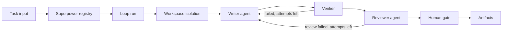

# Loop Engineering Design

Loop Engineering is a separate MateClaw product surface from Troubleshooting
SOP. Troubleshooting SOP handles incidents and evidence from observability
systems. Loop Engineering handles repeatable engineering work such as fixing a
reproducible failing test, reviewing PR risk, or upgrading a dependency.

## Boundary

Troubleshooting SOP:

- Domain: incidents, alerts, infrastructure and application symptoms.
- Contract source: `mate_skill` skills with a `troubleshooting` manifest block.
- Run table: `mate_troubleshooting_sop_run`.
- Evidence: metrics, logs, releases, Kubernetes, Guance and other read-only
  connectors.
- Output: incident checklist, evidence sufficiency, group-safe report.

Loop Engineering:

- Domain: code work loops and engineering operations.
- Contract source: `mate_skill` skills with a `superpower` manifest block.
- Run table: `mate_loop_run`.
- Evidence: baseline command, worktree metadata, verifier logs, diff summary,
  reviewer decision, generated artifacts.
- Output: evidence bundle, patch, review, run result, and a human gate before
  commit or push.

The two modules can reuse concepts such as manifests, run traces, step results,
evidence records, validators, and report rendering. They should not share
controllers, UI pages, database tables, or domain vocabulary.

## MVP Scope

The first superpower is `loop-fix-failing-test`.

It accepts one clear engineering task:

- repository path
- failing command
- short goal
- optional branch or case id

The first implementation does not automatically push, commit, or merge. It
creates a planned run and records the contract that a later runtime will execute.

## Manifest Contract

```yaml
type: prompt
category: superpower
superpower:
  domain: code_refix
  scenario: fix_failing_test
  trigger:
    type: manual
    sources: [manual, ci_failure, pr_comment]
  workspace:
    isolation: git_worktree
    allowedPaths: [src, test, tests]
  policy:
    maxIterations: 3
    maxChangedFiles: 8
    requireHumanBeforePush: true
    allowedCommands: [mvn test, npm test]
  verification:
    required: [baseline_failure_reproduced, target_tests_pass, diff_review_passed]
    recommended: [lint_passed, build_passed]
  outputs: [evidence.md, diff.patch, review.md, result.json]
  owner: engineering-platform
  reviewCycleDays: 90
```

`SKILL.md` body remains the executable instruction contract. The typed manifest
only makes the skill discoverable, previewable, and auditable.

## Runtime Shape



The first code skeleton lands `B` and `C`. Runtime execution starts as a
planned state so the product boundary can be reviewed before write-capable
automation is enabled.

## Initial API

- `GET /api/v1/loop-engineering/superpowers`
- `POST /api/v1/loop-engineering/superpowers/preview`
- `POST /api/v1/loop-engineering/runs`
- `GET /api/v1/loop-engineering/runs/{id}`
- `POST /api/v1/loop-engineering/runs/{id}/execute`

`execute` is intentionally a stub in the first skeleton. It returns the run and
states that execution is not enabled yet.

## Persistence

`mate_loop_run` stores the minimum auditable run shell:

- `workspace_id`
- `superpower_skill_id`
- `superpower_name`
- `superpower_version`
- `domain`
- `scenario`
- `status`
- `input_json`
- `step_results_json`
- `artifacts_json`
- `final_report_json`
- timestamps and soft delete flag

Artifacts are initially JSON references. A later iteration can introduce a
separate artifact table when diffs, logs, and evidence files need retention
policy and download controls.

## Next Build Steps

1. Add the `loop-fix-failing-test` built-in skill.
2. Parse the typed `superpower` manifest block.
3. Add superpower listing and preview APIs.
4. Add `mate_loop_run` and create/get run APIs.
5. Build a read-only UI page after the backend skeleton is stable.
6. Add worktree and verifier execution behind an explicit human-controlled flag.
