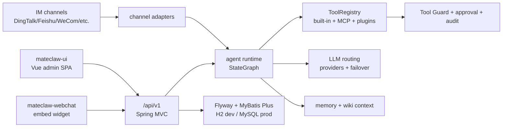

# MateClaw Repo Wiki

**Analysis date:** 2026-05-19

This wiki is a developer-facing map of the MateClaw repository. The product docs under `mateclaw-server/src/main/resources/docs/` explain how to use MateClaw; this wiki explains where the code lives, how requests move through the system, and where to change things safely.

## Reading Order

1. [Architecture](./architecture.md) - process shape, module boundaries, and the main chat/agent request path.
2. [Backend](./backend.md) - Spring Boot packages, persistence, API surface, runtime services, and test map.
3. [Frontend](./frontend.md) - Vue app layout, routing, stores, API client, chat streaming, and build behavior.
4. [Integrations](./integrations.md) - LLM providers, tools, skills, MCP, ACP, channels, plugins, browser, and multimodal providers.
5. [Development Guide](./development.md) - local setup, verification commands, common change recipes, and known gotchas.

## Repository Shape

```text
mateclaw/
├── mateclaw-server/          Spring Boot 3.5 backend and bundled product docs
├── mateclaw-ui/              Vue 3 + TypeScript admin console
├── mateclaw-webchat/         Embeddable chat widget library
├── mateclaw-plugin-api/      Java plugin SDK exposed to external capability packs
├── mateclaw-plugin-sample/   Hello-world plugin implementation
├── docker/                   Sidecar image config, currently SearXNG
├── assets/                   README architecture diagrams and preview images
├── docker-compose.yml        MySQL + SearXNG + server deployment
└── pom.xml                   Maven reactor parent for Java modules
```

## One-Screen Mental Model

MateClaw is a modular monolith with several product surfaces around one Spring Boot core.



The backend owns runtime truth: auth, workspace isolation, agent execution, tool policy, model routing, channels, wiki, workflow, trigger, and persistence. The frontend is a feature-rich operator console over those APIs.

## Important Handles

| Concern | Start Here |
|---|---|
| App bootstrap | `mateclaw-server/src/main/java/vip/mate/MateClawApplication.java` |
| Backend config | `mateclaw-server/src/main/resources/application.yml`, `application-mysql.yml` |
| Auth and request security | `vip/mate/config/SecurityConfig.java`, `JwtAuthFilter.java` |
| Chat SSE API | `vip/mate/channel/web/ChatController.java` |
| Agent CRUD/runtime cache | `vip/mate/agent/AgentService.java` |
| Agent graph assembly | `vip/mate/agent/AgentGraphBuilder.java` |
| Tool discovery | `vip/mate/tool/ToolRegistry.java` |
| Browser/CDP tool | `vip/mate/tool/builtin/BrowserUseTool.java`, `skills/browser_cdp/SKILL.md` |
| LLM provider construction | `vip/mate/llm/chatmodel/ProviderChatModelFactory.java` |
| Provider capability routing | `vip/mate/llm/routing/ProviderRouter.java` |
| Channel lifecycle | `vip/mate/channel/ChannelManager.java` |
| Wiki ingest | `vip/mate/wiki/service/WikiProcessingService.java` |
| Workflow publish lifecycle | `vip/mate/workflow/service/WorkflowService.java` |
| Frontend route map | `mateclaw-ui/src/router/index.ts` |
| Frontend API wrapper | `mateclaw-ui/src/api/index.ts` |
| Frontend chat composable | `mateclaw-ui/src/composables/chat/useChat.ts`, `useStream.ts` |
| Plugin SDK | `mateclaw-plugin-api/src/main/java/vip/mate/plugin/api/` |

## What This Repo Is Optimized For

- Self-hosted enterprise AI assistant: one Spring Boot process, one deployable JAR, MySQL in production and H2 for development.
- Long-running agent work: StateGraph ReAct / Plan-and-Execute loops, SSE events, stream recovery, tool result spill, context compaction, and runtime console.
- Capability extension: `@Tool` beans, SKILL.md packages, MCP servers, ACP coding agents, Java plugins, IM channels, and multimodal providers.
- Operator controls: workspaces, RBAC capabilities, Tool Guard, approval workflows, audit events, provider health, and channel leader leases.

## Local Baseline

```bash
# Backend, requires Java 21
cd mateclaw-server
mvn spring-boot:run

# Frontend
cd mateclaw-ui
pnpm install
pnpm dev
```

Default login is `admin` / `admin123`. In this workspace, the system default Java was Java 8 during setup, so use Java 21 explicitly if Maven starts with the wrong JDK.

