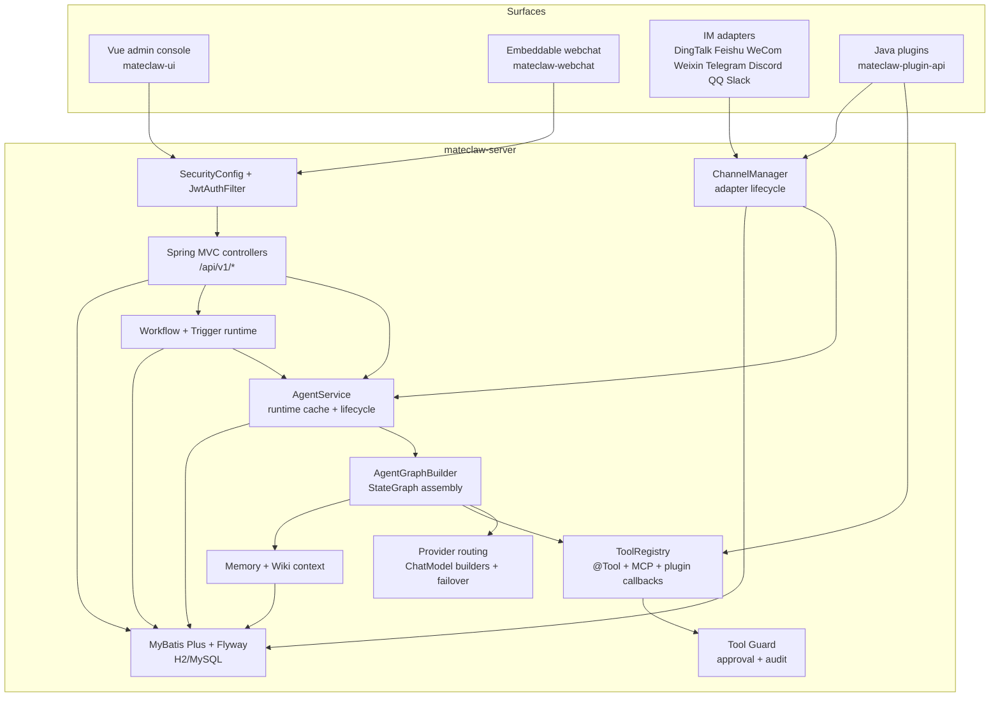
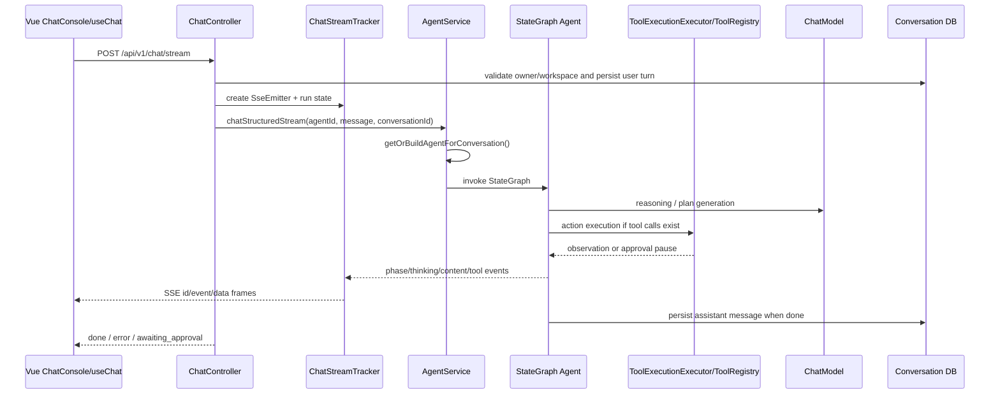

# Architecture

**Analysis date:** 2026-05-19

MateClaw is a Spring Boot modular monolith with a Vue admin console and optional external surfaces. The core design is not "a chatbot plus tools"; it is an agent harness where models, memory, tools, skills, approval, channels, and workflow all meet in the backend.

## Runtime Topology

## The Main Chat Path

The main web chat route is `POST /api/v1/chat/stream` in `vip/mate/channel/web/ChatController.java`. It produces structured SSE events, supports reconnect, and routes through `AgentService`.

Key implementation handles:

- `ChatController.chatStream()` handles normal requests and reconnects.
- `AgentService` owns CRUD and runtime graph cache keyed by agent and conversation model pin.
- `AgentGraphBuilder` resolves model, bindings, tools, prompt, workspace path, and graph type.
- `StateGraphReActAgent` and `StateGraphPlanExecuteAgent` run the compiled graph.
- `ChatStreamTracker` buffers and broadcasts SSE events by conversation.

## Agent Runtime

The agent runtime is a StateGraph, not a deep inheritance tree. `AgentGraphBuilder` chooses ReAct or Plan-and-Execute from `AgentEntity.agentType`.

| Runtime Path | Main Classes | Notes |
|---|---|---|
| ReAct | `StateGraphReActAgent`, `ReasoningNode`, `ActionNode`, `ObservationNode`, `FinalAnswerNode` | Iterative reasoning/tool loop with max-iteration safety. |
| Plan-and-Execute | `StateGraphPlanExecuteAgent`, `PlanGenerationNode`, `StepExecutionNode`, `PlanSummaryNode` | Builds and executes explicit plan steps. |
| Streaming | `NodeStreamingChatHelper`, `GraphEventPublisher`, `ChatStreamTracker` | Emits thinking, phase, tool, compact, and content events. |
| Tool execution | `ToolExecutionExecutor` | Enforces Tool Guard, approval, timeouts, result storage, and skill hints. |
| Context window | `ConversationWindowManager` | Handles token budgeting, pair-safe compaction, and summary lifecycle. |

State keys live under `vip/mate/agent/graph/state`. New graph behavior should usually add a node, edge dispatcher, or state key, then wire it in `AgentGraphBuilder`.

## Persistence and Seeding

The database path is:

1. Flyway migrates schema from `mateclaw-server/src/main/resources/db/migration/h2` or `db/migration/mysql`.
2. `DatabaseBootstrapRunner` seeds locale-specific data from `db/data-zh.sql`, `db/data-en.sql`, `db/data-mysql-zh.sql`, or `db/data-mysql-en.sql`.
3. MyBatis Plus mappers under each package's `repository/` directory access tables.

Baseline tables include users, agents, model providers/configs, skills, tools, channels, conversations, messages, workspaces, MCP servers, tool guard, wiki, cron, audit, workflow, triggers, PATs, and feature flags.

## Workspace and Security Boundary

The backend uses stateless Spring Security:

- `SecurityConfig` permits login, setup, webhook/webchat, generated files, and selected stream endpoints.
- `JwtAuthFilter` accepts `Authorization: Bearer ...`, query `token=...` for SSE/EventSource cases, and `mc_*` Personal Access Tokens.
- Route-level and service-level workspace boundaries appear throughout APIs. Example: chat checks `X-Workspace-Id` against the selected agent before running.
- Frontend route guards consume `/api/v1/workspaces/{id}/access` capabilities through `useWorkspaceStore`.

## Build and Deployment Shape

Local development normally runs two processes:

- backend: `mateclaw-server` on `18088`
- frontend dev server: `mateclaw-ui` on `5173`, proxying `/api` and `/skill-assets` to `18088`

Production Docker builds a single server image:

1. Node stage builds Vue static files.
2. Maven stage packages `mateclaw-server`.
3. Runtime stage uses `mcr.microsoft.com/playwright:v1.59.0-noble`, installs JRE 21 and CJK/OCR/PDF dependencies, and serves the JAR.

## Design Biases

- Prefer backend-owned policy: auth, workspace access, model config, tool availability, and approval live server-side.
- Prefer structured runtime events over ad hoc text: chat SSE events are typed and front-end composables understand those event names.
- Prefer explicit extension surfaces: `@Tool`, SKILL.md, MCP, ACP, channel adapters, and Java plugins all have separate registration paths but converge in runtime registries.
- Prefer H2/MySQL parity: schema changes must land in both migration trees.

