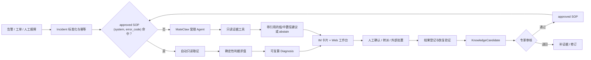

# IT 智能排障系统 · 历史架构 v3（MateClaw-only）

> 状态：**已被 `intelligent-troubleshooting-architecture-v4.md` 取代，仅供追溯**
>
> 当时产品基线：`docs/intelligent-troubleshooting/architecture-blueprint.html` v0.4（已被 v0.5 取代）
>
> 设计来源：回归蓝图 v0.3 的主线——**告警驱动 · 智能路由 · 自动取证 ·
> 人机协同诊断 · 知识闭环**；删除旧 Python 平台及其代理、Memory、Evolver、独立运行时假设，
> 全部能力统一落在当前 Java **MateClaw** 中。
>
> `intelligent-troubleshooting-architecture-v2.md` 与 `meeting-change-plan.md` 保留为历史讨论，
> 不再决定当前产品主线；`intelligent-troubleshooting-design.md` 继续作为源码核对与安全论证附录。

## 0. 结论先行

这不是一个“让大模型自由排障”的系统，而是 MateClaw 内的一个**证据驱动的排障领域模块**：

1. `(system, error_code)` 命中已批准 SOP 时，由确定性 Java 完成取证、判据求值和诊断，**零 LLM**。
2. 未命中时，才调用 MateClaw 的受限 Agent；它只能使用一个只读取证工具，必须引用证据，
   低置信或证据不足时必须弃权。
3. 系统可以自动执行只读动作；转派由人接手；生产写操作只提供步骤，始终在系统外由人执行并登记结果。
4. 关闭故障时生成知识候选，经人工审核后才能晋升为权威 SOP；MateClaw 的 Skill、Memory、Wiki
   可接收审核后的派生内容，但不能反向覆盖诊断权威。

## 1. 设计公理

| 编号 | 公理 | 工程含义 |
|---|---|---|
| A1 | 诊断必须可复算 | 结论必须能追溯到 Incident、SOP 版本、EvidenceResult 与 CriterionOutcome |
| A2 | 确定性知识拥有裁决权 | approved SOP 与类型化判据是命中路唯一权威 |
| A3 | 智能只补未知，不改已知 | Agent 只进入未命中路，不参与已命中 SOP 的路由与裁决 |
| A4 | 自动化止于只读 | 生产写工具不注册、不调用；“批准”只推进领域状态 |
| A5 | 不完整比编造更好 | 取证失败、引用失效、低置信时 fail closed / abstain |
| A6 | 学习不能绕过审核 | 处置结果先成为 candidate，人工批准后才可进入 approved |
| A7 | 一套能力只有一个实现 | 命中路和未命中路共用 EvidenceSourceRouter，不复制连接器逻辑 |
| A8 | MateClaw 是唯一运行底座 | 同一 Java 服务、身份、工作区、模型配置、通道和审计，不设第二套平台 |

## 2. 产品闭环



系统要优化的是“从事件到可信处置上下文”的时间，不是追求无人值守。最小成功标准是：
**一线不再跨系统翻资料，接手人拿到的是证据、判断依据、下一步和责任边界。**

## 3. 总体架构

### 3.1 六层职责

| 层 | 深模块 | 主要职责 | MateClaw 落点 |
|---|---|---|---|
| ① 接入层 | Incident Intake | 多入口归一、workspace 身份、五分钟幂等、脱敏 | `TroubleshootingController`、`TroubleshootingIntakeService` |
| ② 路由层 | SOP Registry | 用 `(system, error_code)` 精确命中 approved SOP；冲突即拒绝 | `TroubleshootingSopPersistenceService` |
| ③ 诊断层 | Diagnosis Orchestration | 命中路确定性编排；未命中路受限 Agent；统一生成 Diagnosis | `DeterministicDiagnosisService`、`TroubleshootingAgentTriageService` |
| ④ 取证层 | Evidence Router | 语义请求路由到只读数据源，归一 canonical evidence，失败关闭 | `EvidenceSourceRouter`、`EvidenceSourceAdapter` |
| ⑤ 处置层 | Diagnosis Lifecycle | 确认、转派、批准但不执行、结果登记、关闭；拒绝跳步 | `DiagnosisStateMachine`、`DiagnosisLifecycleService` |
| ⑥ 闭环层 | Knowledge Lifecycle | candidate→approved→deprecated、Outbox、审核后派生发布 | `KnowledgeCandidate`、`KnowledgeOutboxPoller` |

### 3.2 包与依赖方向

```text
channel / web
      │
controller
      │
service ───────────────► agent (miss-path only)
  │  │                       │
  │  ├────► engine           └────► AgentService.chatWithToolAllowlist
  │  ├────► evidence ───────────────────────┘
  │  ├────► statemachine
  │  └────► knowledge
  │
repository / model / event
```

依赖纪律：

- `engine` 只依赖不可变 record，不读 Entity、不调外部系统。
- `evidence` 对外只暴露 canonical `EvidenceResult`，数据源特有字段不向上泄漏。
- `agent` 只能通过同一个 Router 取证，不拥有第二套连接器。
- `knowledge` 可以向 MateClaw Wiki/Skill/Memory 派生内容；这些平台能力不得回写 approved SOP。
- native Workflow 不承载命中路。当前 Workflow 的工作步骤最终调用 Agent，无法保证零 LLM。

## 4. 双路脊柱

### 4.1 命中路：确定性、零 LLM

```text
IncidentContext
  → lookup approved SopEntry(system, errorCode)
  → EvidenceSourceRouter.collect(EvidenceRequest...)
  → CriterionEvaluator.evaluate(AnomalyCriterion...)
  → DeterministicDiagnosisDraft
  → Diagnosis + evidence citations + derivation
  → DiagnosisStateMachine
```

硬约束：

- 路由只看明确字段，不让模型“猜一条最像的 SOP”。
- 每个结论保存 `sopId/sopVersion/queryId/criterionOutcome`，可离线复算。
- 任一关键证据 `MISSING` 时，规则按声明语义处理；不能把缺失当正常。
- 命中路不得调用 `AgentService`、Memory、Skill、Wiki 或 provider fallback。

### 4.2 未命中路：受限 Agent、证据引用、可以弃权

```text
IncidentContext（脱敏 + 独立预算）
  → TroubleshootingAgentTriageService
  → AgentService.chatWithToolAllowlist(...)
  → collect_troubleshooting_evidence（唯一可见工具）
  → EvidenceSourceRouter
  → 结构化输出解析 + queryId 引用校验
  → MEDIUM/LOW Diagnosis 或 abstain
```

安全边界：

- 显式开关，默认关闭；专用 workspace-local Agent、ReAct、唯一 enabled 模型。
- 不注入会话历史、Memory、Wiki、Skill、Goal 或运行时上下文。
- 关闭模型原生搜索，不启用 provider fallback；运行失败保守弃权。
- 模型只能引用本次活动证据会话返回且非 `MISSING` 的 queryId。
- 有效的 Agent 结论最高为 `MEDIUM`；无有效引用、低置信或结构不合法时强制 `LOW + abstain`。
- ToolGuard 的 BLOCK 是纵深防御，不是主要隔离边界。

## 5. 稳定契约

### 5.1 IncidentContext

最少包含：

```text
incidentId, workspaceId, system, errorCode?, symptom,
severity, occurredAt, source, traceId?, service?, metadata(redacted)
```

`system` 与 `errorCode` 共同构成路由键。没有错误码时明确进入未命中路；当前版本不让模型参与路由。

### 5.2 SopEntry

```text
sopId, version, system, errorCode, status,
evidenceRequests[], anomalyCriteria[], recommendedActions[],
owner, origin, updatedAt
```

只有 `approved` 可用于命中路。`candidate` 只可预览和审核，`deprecated` 不再路由。

### 5.3 EvidenceRequest / EvidenceResult

SOP 存平台无关的语义请求，Adapter 负责翻译成观测平台查询：

```text
EvidenceRequest = requestId + signalKind + parameters + timeWindow
EvidenceResult  = queryId + metric + value + status + summary
                  + observed + source + collectedAt
```

Adapter 必须只读、超时有界、脱敏、失败返回 `MISSING`。凭据和原始危险查询不得进入 Diagnosis。

### 5.4 Diagnosis

```text
diagnosisId, incidentId, routeMode, confidence, conclusion,
evidenceCitations[], derivation, recommendedActions[],
status, contractVersion, createdAt
```

`routeMode` 明确区分 `DETERMINISTIC` 与 `LLM_FALLBACK`，前端不得把两种可信度展示成同一语义。

## 6. 接口与适配缝

### 6.1 EvidenceSourceAdapter（现有、主要扩展缝）

```java
interface EvidenceSourceAdapter {
    String platform();
    boolean supports(String signalKind);
    EvidenceResult collect(EvidenceRequest request, IncidentContext incident);
    EvidenceSourceHealth health();
}
```

当前已有 `GuanceEvidenceAdapter` 与 `RecordedReplayAdapter` 两个真实实现，接口已经成立。
新增 Zabbix、Prometheus、Loki 时只增加 Adapter 和路由配置，不修改 SOP、判据或调用方。
MCP 可以作为某个 Adapter 的传输实现，但不是所有取证源的强制形态。

### 6.2 MateClaw Agent 接缝（现有、只用于 miss-path）

领域层只使用 `AgentService.chatWithToolAllowlist(...)` 的硬作用域入口，不使用普通 `chat()`。
`TroubleshootingAgentTriageService` 是排障语义 Adapter：负责预算、脱敏、会话约束、结构校验与降级，
避免 Agent API 细节扩散到 Intake、Evidence 和 Lifecycle。

### 6.3 KnowledgePublicationSink（现有、审核后异步）

关闭故障生成 `KnowledgeCandidate`，事务 Outbox 保证候选事件不丢。
Publisher 失败只影响派生发布，不回滚处置闭环，不改变 approved SOP。

目标发布顺序：

1. 领域 SOP 注册表：人工审核后的唯一权威。
2. MateClaw Wiki：派生的人类可读复盘/Runbook。
3. MateClaw Skill：经再次审核的方法论资产；不得自动启用到受限排障 Agent。
4. MateClaw Memory：个体或团队上下文提示；不得参与确定性路由与判据。

## 7. 动作与权责边界

蓝图中的三类动作保留，但明确执行语义：

| 动作类型 | 系统行为 | 是否自动执行 | 例子 |
|---|---|---:|---|
| `auto_readonly` | 调只读 Adapter 取证并记录证据 | 是 | 查指标、日志、链路、配置快照 |
| `human_contact` | 生成结构化转派包并通知责任人 | 通知可自动，处置由人 | 联系 DBA、网络、业务 owner |
| `manual_unknown` | 动作无法可靠归类时保守转人工 | 否 | 存量 SOP 中语义不完整的步骤 |
| `manual_write` | 展示风险、步骤、回滚与验证项；等待外部结果登记 | **否** | 重启、扩容、改配置、切流 |

“人工批准”只让状态从 `PENDING_APPROVAL` 进入 `APPROVED_NOT_EXECUTED`；它不触发任何生产工具。
外部执行后，由操作人登记 outcome 与恢复验证，系统才允许关闭。

## 8. MateClaw 能力复用边界

| MateClaw 能力 | 本系统怎么用 | 明确不用来做什么 |
|---|---|---|
| Workspace / JWT / PAT / RBAC | 租户隔离、可信操作者、API 门控 | 不接受请求体里的伪 actor |
| Agent / Model Config | 未命中路的受限推理与模型显式绑定 | 不参与命中路，不自动换模型 |
| ToolGuard | BLOCK 写/危险工具，纵深防御 | 不用 NEEDS_APPROVAL 承载人工确认 |
| Channel / Card | 飞书/企微通知与领域回调 | 不让卡片按钮直接执行生产写 |
| Skill | 审核后的方法论发布与复用 | 不自动决定 SOP，不注入当前受限 Agent |
| Memory | 一般 Agent 的上下文能力、复盘辅助 | 不作为路由、判据或结论权威 |
| Wiki | 人类可读的复盘与 Runbook 派生 | 不反向覆盖结构化 SOP |
| Workflow | 可用于外围通知/异步协同 | 不承载确定性命中路 |

所有能力都在同一 MateClaw 服务内进程调用，复用同一身份、数据库、配置与观测。不存在独立代理服务、
独立 Python orchestrator 或额外平台运行时。

## 9. 状态机与处置闭环

```text
NEW
  → DIAGNOSED
  → CONFIRMED
  → TRANSFERRED?               (需要责任人时)
  → PENDING_APPROVAL?          (包含 manual_write 时)
  → APPROVED_NOT_EXECUTED?     (只记批准)
  → OUTCOME_RECORDED
  → RECOVERY_VERIFIED
  → CLOSED
```

状态机拒绝跳步；所有推进保存 actor、workspace、时间和备注。`execute` 端点继续恒拒绝，
生产写能力不进入工具注册表。

## 10. 知识闭环

知识候选只从真实处置结果中产生：

```text
Incident + Diagnosis + Evidence + ActionOutcome + Closure
  → KnowledgeCandidate
  → 脱敏 / 去重 / 完整性检查
  → 专家审核
  → approved SopEntry
  → 进入历史回归集与影子验证
```

知识质量闸门：

- 必须有可复算证据和最终 outcome，只有对话摘要不能晋升。
- 必须明确适用系统、错误码、证据请求、异常判据、动作类型、owner 和回滚/验证要求。
- LLM 可以起草候选说明，不能自行批准、覆盖或废弃 SOP。
- “从日志生成 SOP”是知识候选的一种输入方式，不是架构中心，也不能绕过真实 outcome 与审核。

## 11. 信任阶梯

| 阶段 | 系统权限 | 毕业依据 |
|---|---|---|
| S0 影子 | 后台重放，只比较不展示 | 历史集稳定、无有害高置信错误 |
| S1 建议 | 展示 SOP、证据需求和人工步骤 | 一线反馈可用，引用完整 |
| S2 只读自动化 | 自动取证、确定性诊断、自动通知 | 数据源绑定与阈值经真实环境验证 |
| S3 人机协同 | 状态流转、转派、人工批准、结果登记 | 审计与恢复验证闭环稳定 |

不存在“自动生产写”阶段。可信度按 `(system, error_code, sopVersion, evidenceBinding)` 逐格毕业，
不能用整体成功率给所有 SOP 一次性放权。

## 12. 当前实现与目标差距

### 已有

- P0：契约、类型化判据、确定性诊断、状态机、持久化、Outbox。
- P1：REST 接入、PAT/JWT、workspace capability。
- P2：Web 工作台、SOP 管理、生命周期接口、飞书领域卡片处理。
- P3：`EvidenceSourceRouter`、Guance/Recorded Replay Adapter、源健康状态。
- P4：硬白名单 Agent 入口、只读证据工具、会话隔离、脱敏预算、引用校验与 abstain。

### 未完成或未验证

1. 903001 的真实 Guance measurement、字段和阈值尚未在内网核实。
2. `fixtureMode` 仍应保持开启，live 数据源默认关闭。
3. 专用排障 Agent 默认关闭，尚未按 runbook 完成实机演练。
4. 出站 IM 通知链路、影子回归集、按 SOP 放权指标尚未完成。
5. 知识派生到 Wiki/Skill 仍需独立审核策略；当前不能宣称自动学习闭环已经成立。

## 13. 实施顺序

### P0 · 先验证真实竖线

1. 清理 `(system, error_code)` 冲突与源数据损坏。
2. 用 903001 跑通 recorded replay 的完整处置闭环。
3. 在内网核实 Guance 查询、字段、阈值和脱敏。
4. 建 20–30 条历史样本，跑 S0 影子回归。

### P1 · 再开放协同

1. 接通一条 IM 出站通知与 Web 回落。
2. 实机配置并验证专用受限 Agent，保持默认关闭和一键回滚。
3. 建 candidate 审核队列、质量看板和 SOP 版本回归。

### P2 · 最后扩系统与知识派生

1. 接第二个业务系统验证复合路由键与 owner 边界。
2. 接第二种证据源验证 Adapter 深度。
3. 在人工审核后派生 Wiki/Skill；评估是否需要 MCP 形式的远程 Adapter。

## 14. 已锁定决定

| 编号 | 决定 |
|---|---|
| D1 | 确定性 / 智能边界是 approved `(system, error_code)` 是否命中 |
| D2 | 结构化领域 SOP 是唯一诊断权威，生命周期为 candidate→approved→deprecated |
| D3 | Web 工作台是完整上下文入口，IM 是通知与轻操作入口 |
| D4 | 命中路为 Java 领域编排；未命中路使用 MateClaw 硬白名单 Agent |
| D5 | 上线采用影子→建议→只读自动化→人机协同，永不自动生产写 |
| D6 | 知识沉淀嵌入关闭流程，LLM 只起草，专家负责批准 |
| D7 | 系统是 MateClaw 单体内的 `vip.mate.troubleshooting` 深模块 |
| D8 | 取证以 `EvidenceSourceRouter` / `EvidenceSourceAdapter` 为开放接缝，MCP 可选 |

任何后续设计若要修改 D1、D4 或生产写边界，必须单独提出 RFC 并由用户明确确认，不能通过实现细节悄悄扩大。
